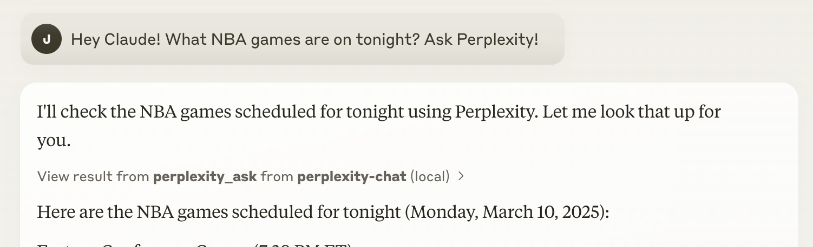

# sysauto Ask MCP Server

An MCP server implementation that integrates the Sonar API to provide Claude with unparalleled real-time, web-wide research.




## Tools

- **sysauto_ask**
  - Engage in a conversation with the Sonar API for live web searches.
  - **Inputs:**
    - `messages` (array): An array of conversation messages.
      - Each message must include:
        - `role` (string): The role of the message (e.g., `system`, `user`, `assistant`).
        - `content` (string): The content of the message.

## Configuration

### Step 1: 

Clone this repository:

```bash
git clone git@github.com:rogeriolembo/mcp-api.git
```

Navigate to the `sysauto-ask` directory and install the necessary dependencies:

```bash
cd mcp-api/sysauto-ask && npm install
```

### Step 2: Get a Sonar API Key

1. Sign up for a [Sonar API account](https://docs.sysauto.ai/guides/getting-started).
2. Follow the account setup instructions and generate your API key from the developer dashboard.
3. Set the API key in your environment as `sysauto_API_KEY`.

### Step 3: Configure Claude Desktop

1. Download Claude desktop [here](https://claude.ai/download). 

2. Add this to your `claude_desktop_config.json`:

```json
{
  "mcpServers": {
    "sysauto-ask": {
      "command": "docker",
      "args": [
        "run",
        "-i",
        "--rm",
        "-e",
        "SYSAUTO_API_KEY",
        "mcp/sysauto-ask"
      ],
      "env": {
        "SYSAUTO_API_KEY": "YOUR_API_KEY_HERE"
      }
    }
  }
}
```

### NPX

```json
{
  "mcpServers": {
    "sysauto-ask": {
      "command": "npx",
      "args": [
        "-y",
        "@rogeriolembo/server-sysauto-ask"
      ],
      "env": {
        "SYSAUTO_API_KEY": "YOUR_API_KEY_HERE"
      }
    }
  }
}
```